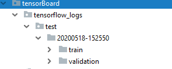
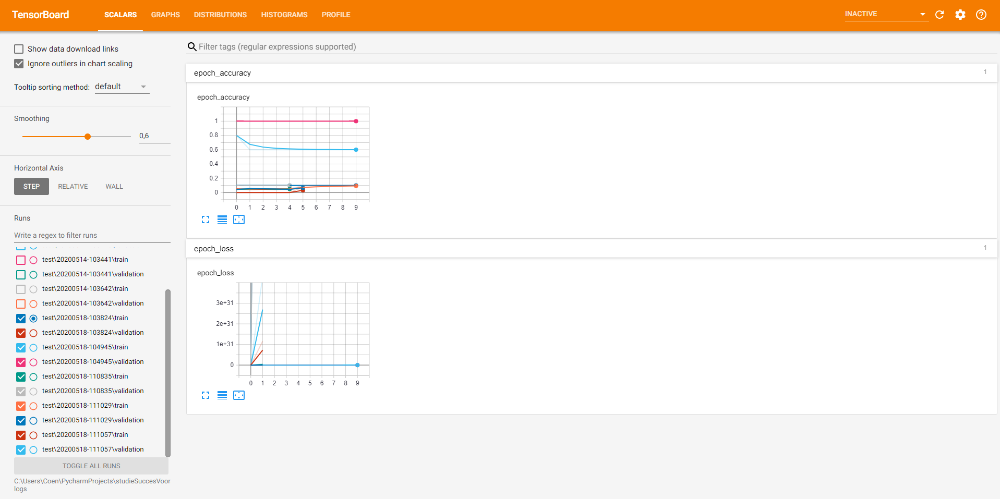

# TensorBoard
In dit bestand staat wat informatie over het installeren / gebruik van TensorBoard.
Een voorbeeld code is in het bestand test.py te vinden.
## Installatie
Om TensorBoard te installeren moet het volgende commando uitgevoerd worden. Er wordt gebruik gemaakt van 2.0.0 omdat 2.1.1 niet werkt in de browser en daar een blanke pagina laat zien. 
*  pip install tensorboard==2.0.0  

## Gebruik
  Om TensorBoard te draaien voer je volgende commando uit:
* tensorboard --logdir=*%*logdir*%* --port 6060
* Open de browser en ga naar localhost:6060

Op de plaats van %*logdir*% zet je de locatie van waar je de logs opslaat neer. Voorbeeld:
C:\Gebruikers\Pietje\PycharmProjects\studieSuccesVoorspellerAI\tensorBoard\tensorflow_logs

## Toepassing voorbeeld

    
De datetime wordt geïmporteerd voor de bestandsnaam  

    
    from datetime import datetime

Log bestand wordt aangemaakt op de locatie \\tensorflow_logs\\test\\ met datetime als naam.

    log_dir= ".\\tensorflow_logs\\test\\"+datetime.now().strftime("%Y%m%d-%H%M%S")  
    tensorboard_callback = tf.keras.callbacks.TensorBoard(log_dir=log_dir, histogram_freq=1)

De tensorboard_callback als parameter toevoegen aan de model.fit() functie.

    callbacks=[tensorboard_callback]
    
Na het succesvol runnen worden de bestand gegenereerd.
    

---

## Het board
Als het gelukt is TensorBoard te installeren en te starten krijg je een scherm te zien dat lijkt op de afbeelding hieronder. 

Een korte beschrijving van de getoonde dashboards (tabbladen in de menubalk): 

**Scalars**
Het Scalars-dashboard laat zien hoe de loss/accuracy en de metrics veranderen met elke epoch. Je kunt het ook gebruiken om de trainingssnelheid, de leersnelheid bij te houden.

**Graphs**
Het dashboard van Graphs helpt bij het visualiseren van het model.

**Distributions en Histograms**
De dashboards voor Distributies en Histogrammen tonen de verdeling van een Tensor in de tijd. Dit kan nuttig zijn om weights en biases te visualiseren en te controleren of ze op een verwachte manier veranderen.

---
## Conclusie
Het TensorBoard kan voor ons project van waarde zijn om een goed inzicht te krijgen in de loss en accuratie en zo kunnen we beter nagaan wat het beste werkt voor onze applicatie. 
TensorBoard werkt met Keras dus er moet wel een model gemaakt worden met Keras wat bovenop TensorFlow werkt.  

